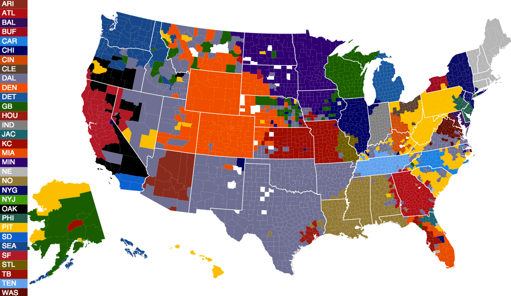
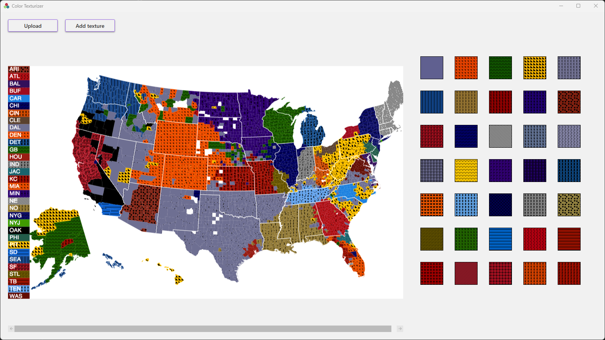
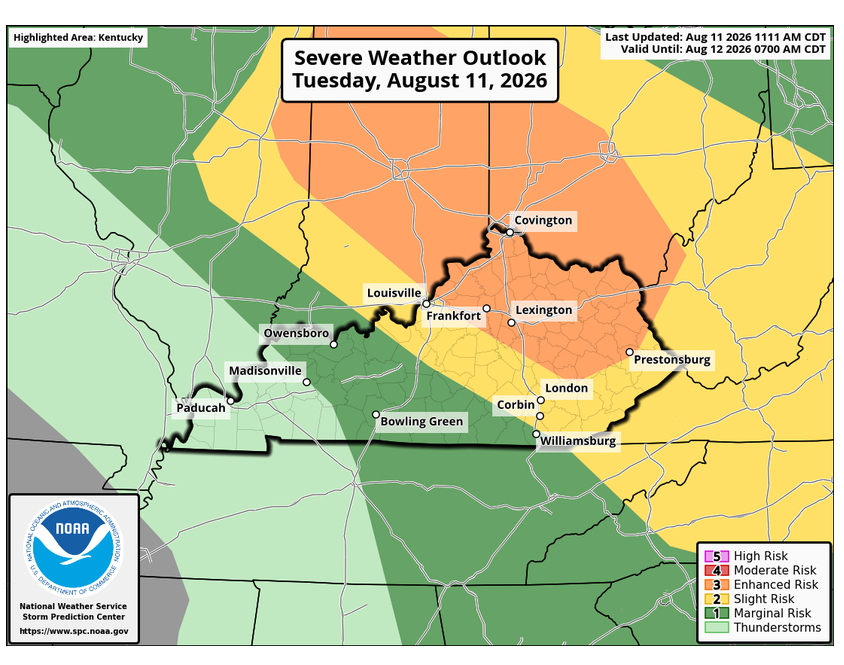
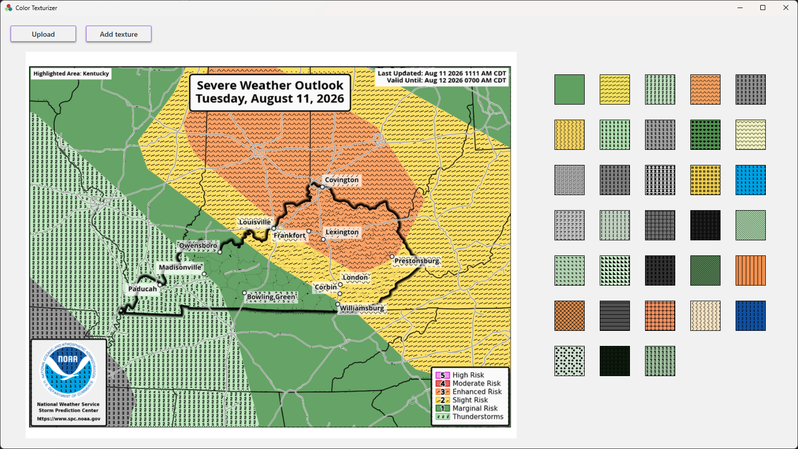

# Color Texturizer

A WPF application assigning textures to color regions to help colorblind users distinguish different colors on color-coded maps, charts, etc. Inspired by my own experience being red-green colorblind.
 
**Example 1**

**Example 2**

## Summary
The program finds all the colors in an image, trims the smallest colors to avoid noise, and determines groups of connected pixels sharing these colors. The bounds of the color regions are then determined, and textures placed over the regions to give them a unique trait besides color alone.

Early attempts using exact color matching yielded inconsistent results, so colors had to be grouped into buckets of visually similar shades to actually match what looks like one color to the human eye. The groups are determined using a stack-based flood fill algorithm each time a pixel with a tracked color is found.

Once all color regions are found, textures are assigned randomly to each color. One color can have multiple groups, so textures were assigned per color instead of per region. At this point the program will not display any textures yet, but it displays squares with RGB values of the most prominent colors in the image. When the user clicks the add texture button, the program determines the bounds of the color regions in the image and applies a texture over them.

Due to the sporadic, unpredictable nature of images, it is difficult to find a sweet spot when determining which colors should be included in the texturizing process. The program leans on the side of safety, including more, smaller color regions to be sure the tool remains useful on maps with small regions. Due to this, the color preview panel can show unimportant colors, but images remain readable and accessible because of this choice.

The tool is not meant to be used on camera images, but intentionally designed ones.
